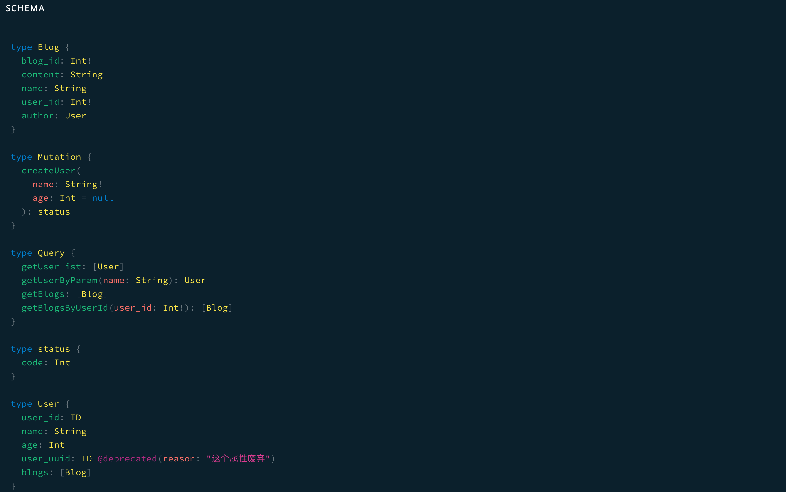
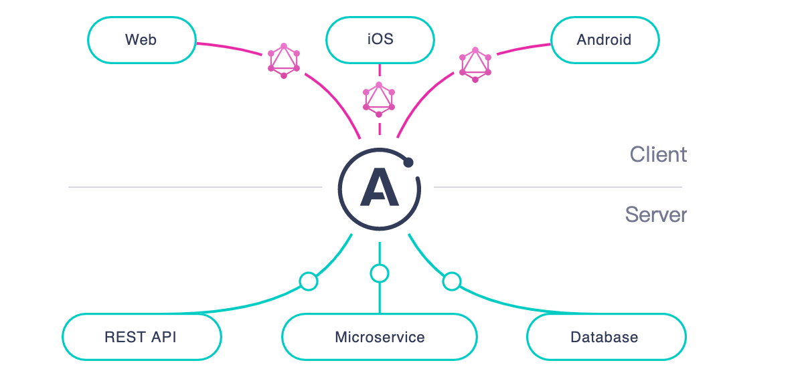
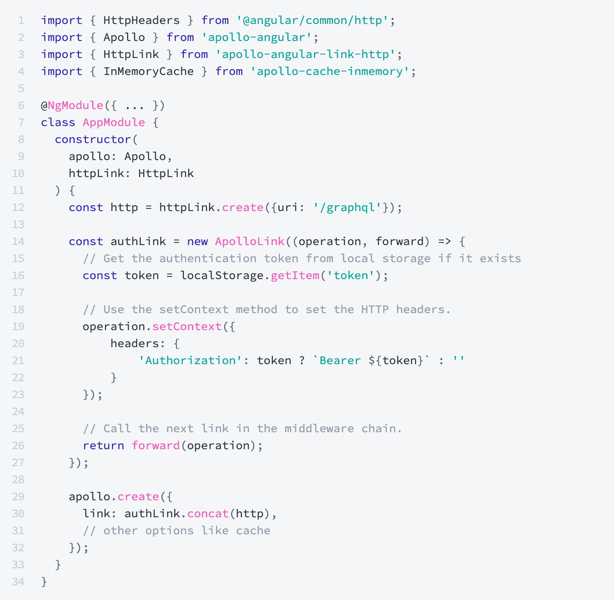

title: Hello GraphQL
speaker: shuxun
plugins:

- echarts: {theme: infographic}
- mermaid: {theme: forest}
- katex

<slide class="bg-black aligncenter" image="https://source.unsplash.com/n9WPPWiPPJw/ .anim">


## Hello GraphQL {.text-landing.text-shadow}

By shuxun.yin {.text-intro}

[:fa-github: Github](https://github.com/yinshuxun/graphql-microservice-practice){.button.ghost}

<slide class="bg-black-blue" image="https://source.unsplash.com/n9WPPWiPPJw/ .dark">
:::column {.vertical-align}
## 聊一聊 Rest & Restful
---

一、起源

REST 这个词，是[Roy Thomas Fielding](http://en.wikipedia.org/wiki/Roy_Fielding)在他 2000 年的[博士论文](http://www.ics.uci.edu/~fielding/pubs/dissertation/top.htm)中提出的。Fielding 将他对互联网软件的架构原则，定名为 REST，即 Representational State Transfer 的缩写，翻译是"表现层状态转化"。

符合 REST 原则的架构可以称之为 Restful 架构

<slide class="bg-black-blue" image="https://source.unsplash.com/n9WPPWiPPJw/ .dark">
:::column {.vertical-align}

## 聊一聊 Rest & Restful

---

二、Restful api 特点

1、每一个 URI 代表 1 种资源

2、客户端使用 GET、POST、PUT、DELETE、PATCH 这些动词 来表示对资源的不同操作

3、客户端与服务端之间的请求 是无状态的，每个请求都必须带上供服务端解析的所有必需信息
:::

<slide class="bg-black-blue " image="https://source.unsplash.com/n9WPPWiPPJw/ .dark">
:::div {.vertical-align}
##  GraphQL 是什么？怎么开始的 ？

### 一、起源

GraphQL 的起源可追溯到 行业向移动端转变的时候。在 2012 年，Facebook 决定需要在移动端构建一个新闻推送 API，但是受限于 Rest api 的 高延时、高带宽的问题，由此 GraphQL API 应运而生。
:::

<slide class="bg-black-blue " image="https://source.unsplash.com/n9WPPWiPPJw/ .dark">
:::div {.vertical-align}
## 二、是什么
---
GraphQL 是一个用于 API 的查询语言，是一个使用基于类型系统来执行查询的服务端运行时。

主要特征：

- 它允许客户端指定具体所需的数据。
- 它让从多个数据源汇总取数据变得更简单。
- 它使用了强类型系统来描述数据。

:::

<slide class="bg-black-blue " image="https://source.unsplash.com/n9WPPWiPPJw/ .dark">

:::div {.content-left}

## 三、核心概念

---

- [Schema](https://graphql.cn/learn/schema)
- [类型系统](https://graphql.cn/learn/schema/#type-system)
- [Operation](https://graphql.cn/learn/queries/#operation-name)

:::
:::div {.content-left}

:::

<slide class="bg-black-blue " image="https://source.unsplash.com/n9WPPWiPPJw/ .dark">
:::div {.vertical-align}
## 四、生态系统
:::div {.content-left}
#####  GraphQL 服务端
* [GraphQL-JS](https://github.com/graphql/graphql-js): 是 GraphQL 原始参考实现，可以与 Express、Koa 一起使用。
* [GraphQL-Server](https://www.apollographql.com/docs/apollo-server/): 是 Apollo 的一体式 GraphQL 服务器实现，正在迅速获得关注。它可以从任何 GraphQL 客户端查询。
#####  GraphQL 客户端
* [Apollo Client](https://github.com/apollographql/apollo-client): 提供了每个UI框架和GraphQL服务器的功能齐全的 GraphQL客户端，主流UI框架上层封装版本 如apollo-angular、react-apollo
:::
:::div {.content-left}

:::
:::

<slide class="bg-black-blue " image="https://source.unsplash.com/n9WPPWiPPJw/ .dark">
:::div {.vertical-align}

##### GraphQL 其他开源工具

- [graphiql](https://github.com/graphql/graphiql): 一款运行于浏览器的 GraphQL IDE，几乎所有的服务端库都会提供这么一个经典的 web 页面。该页面是一个单页面应用，可以直接在其上运行查询语句，自带代码补全和校错功能，直接查看 GraphQL 所有的文档(定义好的 Schema)
- Apollo Client DevTools Chrome Extension
- IDEA / EDITOR Plugins
- [graphql-voyager](https://apis.guru/graphql-voyager/): Represent any GraphQL API as an interactive graph. It's time to finally see the graph behind GraphQL! 用交互式的 Schema 图表展示任意的 GraphQL API，总算能看见 GraphQL 背后的 graph 了! （在 Github API 4.0 开放出的 GraphQL API，它将 Github 所有的对外类型都暴露出来了，提供给开发者开发插件的）
- [Graphql-Network](https://github.com/Ghirro/graphql-network): Chrome 的调试工具，由于 GraphQL 查询语句是一串字符串，浏览器审查元素看起来非常难看，这个工具则可以将其格式化成我们想要的格式。
- [GraphDoc](https://github.com/2fd/graphdoc): 可以将文档页面生成静态文档站点。
- [Graphql Codegen](https://github.com/dotansimha/graphql-code-generator): 可扩展的 graphql 代码生成工具
  :::
  :::

<slide class="bg-white-blue" image="https://source.unsplash.com/n9WPPWiPPJw/ .dark">
:::div {.vertical-align}
## Angular 中使用
---
```{json}
# installing Apollo Angular in Angular CLI
ng add apollo-angular
或者
# installing each piece independently
yarn add apollo-client apollo-cache-inmemory apollo-angular-link-http apollo-angular-link-error apollo-angular graphql-tag graphql
```
:::

<slide class="bg-white-blue" image="https://source.unsplash.com/n9WPPWiPPJw/ .dark">
:::div 
## Graphql Queries
---
```{javascript}
query allUser {
  getUserList {
    name
    user_id
    blogs {
      name
    }
  }
}
```
:::

<slide class="bg-white-blue" image="https://source.unsplash.com/n9WPPWiPPJw/ .dark">
:::div 
## Graphql Mutations
---
```
mutation user($name: String!, $age: Int!) {
      createUser(name: $name, age: $age) {
        code
      }
    }
```
:::

<slide class="bg-white-blue" image="https://source.unsplash.com/n9WPPWiPPJw/ .dark">
:::div 
## Graphql Fragment
---
```{graphql}
export class UserFragements {
  blogFragment = gql`
    fragment blogFragment on Blog {
      name
      blog_id
      content
    }
  `;

userFragment = gql`fragment userFragment on User { name age user_id blogs { ...blogFragment } } ${this.blogFragment}`;
}

````
:::

<slide class="bg-white-blue" image="https://source.unsplash.com/n9WPPWiPPJw/ .dark">
:::div {.content-left}
## Authentication
:::
:::div {.content-left}

:::

<slide class="bg-white-blue" image="https://source.unsplash.com/n9WPPWiPPJw/ .dark">
## Caching
#### apollo-cache-inmemory
---
* addTypename：一个布尔值，以确定是否添加__typename到文档（默认值：true）
* dataIdFromObject：一个函数它接受数据对象，返回在规范化存储时数据对应的唯一标识符。
* fragmentMatcher：默认情况下，InMemoryCache使用 heuristic fragment matcher。如果您在unions和interface上使用fragment，则需要使用* * IntrospectionFragmentMatcher。有关更多信息，请阅读我们的指南，为unions和interface设置fragment匹配。
* cacheRedirects（以前称为cacheResolvers或customResolvers）：在请求发生之前将查询重定向到缓存中的另一个条目的函数映射。如果您有一个项目列表并希望在查询单个项目的详细信息页面上使用列表查询中的数据，这将非常有用。更多关于这一点。

<slide class="bg-white-blue" image="https://source.unsplash.com/n9WPPWiPPJw/ .dark">
## Caching
#### Fetch Policy
---
* cache-first: default
* cache-only: nofetch
* network-only:forcefetch
* cache-and-network:at same time

<slide class="bg-white-blue aligncenter" image="https://source.unsplash.com/n9WPPWiPPJw/ .dark">

# GrqphQL 相比 REST 有什么优势

---

- 单一入口 {.animated.fadeInUp style="font-size:30px"}
- 便捷文档 {.animated.fadeInUp.delay-400 style="font-size:30px"}
- 避免数据冗余 {.animated.fadeInUp.delay-800 style="font-size:30px"}
- 数据聚合 {.animated.fadeInUp.delay-1200 style="font-size:30px"}

<slide class="bg-white-blue aligncenter" image="https://source.unsplash.com/n9WPPWiPPJw/ .dark">

## **1、单一入口**

---


<slide class="bg-white-blue" image="https://source.unsplash.com/n9WPPWiPPJw/ .dark">

## **2、便捷文档**

:::flexblock


---


---


:::

- 学习成本 {.animated.fadeInUp style="font-size:30px"}
- 操作复杂 {.animated.fadeInUp.delay-400 style="font-size:30px"}
- API 修改和文档难以同步 {.animated.fadeInUp.delay-800 style="font-size:30px"}

<slide class="bg-white-blue aligncenter" image="https://source.unsplash.com/n9WPPWiPPJw/ .dark">

### **3、数据冗余**

:::column {.vertical-align}

### REST

```json
[
  {
    "name": "第一篇博客",
    "blog_id": 1,
    "content": "阿大沙发斯蒂芬三大发送的发的所发生的盛大发售的发生的发送到发送到范德萨发撒第三方sad",
    "user_id": 1
  },
  {
    "name": "第二篇博客",
    "blog_id": 2,
    "content": "爱的色放撒旦法发的撒发大水发的撒范德萨发大水发的萨芬沙发发大发发发发的发发艾弗森的",
    "user_id": 1
  },
  {
    "name": "前端博客说明g",
    "blog_id": 3,
    "content": "阿盛大发售的发生发的说法是",
    "user_id": 3
  },
  {
    "name": "前端博客说明01222",
    "blog_id": 4,
    "content": "的发打发是打发斯蒂芬萨达",
    "user_id": 2
  },
  {
    "name": "知识知识未来的一部分",
    "blog_id": 5,
    "content": "阿斯顿发送到发多少发撒旦法师打发第三方的萨芬",
    "user_id": 1
  }
]
````

---

=> {style="font-size:50px"}

---

### GraphQL

```json
[
  {
    "name": "第一篇博客"
  },
  {
    "name": "第二篇博客"
  },
  {
    "name": "前端博客说明g"
  },
  {
    "name": "前端博客说明01222"
  },
  {
    "name": "知识知识未来的一部分"
  }
]
```

:::

<slide class="bg-white-blue aligncenter" image="https://source.unsplash.com/n9WPPWiPPJw/ .dark">

### **4、数据聚合**

:::column {.vertical-align}

### 用户列表

```json
  [
      {
        "user_id": "1",
        "name": "user01"
      },
      {
        "user_id": "2",
        "name": "tuoni"
      },
      {
        "user_id": "3",
        "name": "绿箭侠"
      },
      ....
  ]
```

---

<span>+<span> {style="font-size:50px"}

---

### 博客列表

```json
 [
      {
        "name": "第一篇博客",
        "blog_id": 1,
        "user_id": 1
      },
      {
        "name": "第二篇博客",
        "blog_id": 2,
        "user_id": 1
      },
      {
        "name": "前端博客说明g",
        "blog_id": 3,
        "user_id": 3
      },
      ....
    ]
```

:::

<slide class="bg-white-blue aligncenter" image="https://source.unsplash.com/n9WPPWiPPJw/ .dark">

### 聚合列表

```json
 [
      {
        "user_id": "1",
        "name": "user01",
        "blogs": [
          {
            "name": "第一篇博客"
          },
          {
            "name": "第二篇博客"
          },
          {
            "name": "知识知识未来的一部分"
          }
        ]
      },
      {
        "user_id": "2",
        "name": "tuoni",
        "blogs": [
          {
            "name": "前端博客说明01222"
          }
        ]
      }
      ....
    ]
```

<slide class="bg-white-blue aligncenter" image="https://source.unsplash.com/n9WPPWiPPJw/ .dark">

## GraphQL 存在的问题

graphQl 也不是没有缺点，主要有以下几个缺点：

- 改造成本
  要使用 GraphQL 对数据源进行管理，我们需要对整个后端模型用 Graphql 类型系统来描述，同时需要改造服务端暴露数据的方式，这无疑成本是巨大的。[Swagger to graphql](https://github.com/yarax/swagger-to-graphql)

- 查询性能
  GraphQL 相比于传统的后端服务更容易出现 N + 1 的问题，尤其是当资源需要通过 RPC 请求从其他微服务中获取时，问题就有些复杂了，并不能通过简单的改变 SQL 查询的方式来解决。这里 GraphQL 可以使用 DataLoader 从业务层面解决了 N + 1 问题，其核心逻辑就是整合多个请求，通过批量请求的方式解决问题。

- ...当然还会在实践过程中遇到其他问题，需要共同去探索

<slide image="https://source.unsplash.com/UJbHNoVPZW0/">

OVER {.aligncenter style="font-size:80px"}
